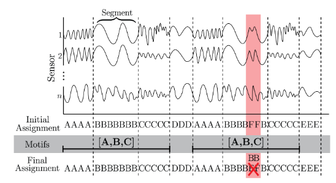

# CASC: Context-Aware Segmentation and Clustering for Motif Discovery in Noisy Time Series Data

Status: Processed
destination: just-for-reference

- [https://arxiv.org/abs/1809.01819](https://arxiv.org/abs/1809.01819)
- Interesting segmentation approach

