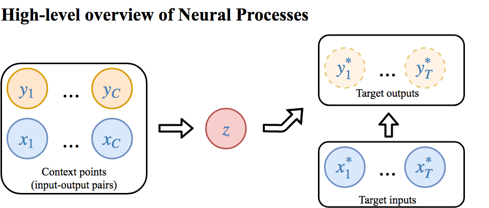
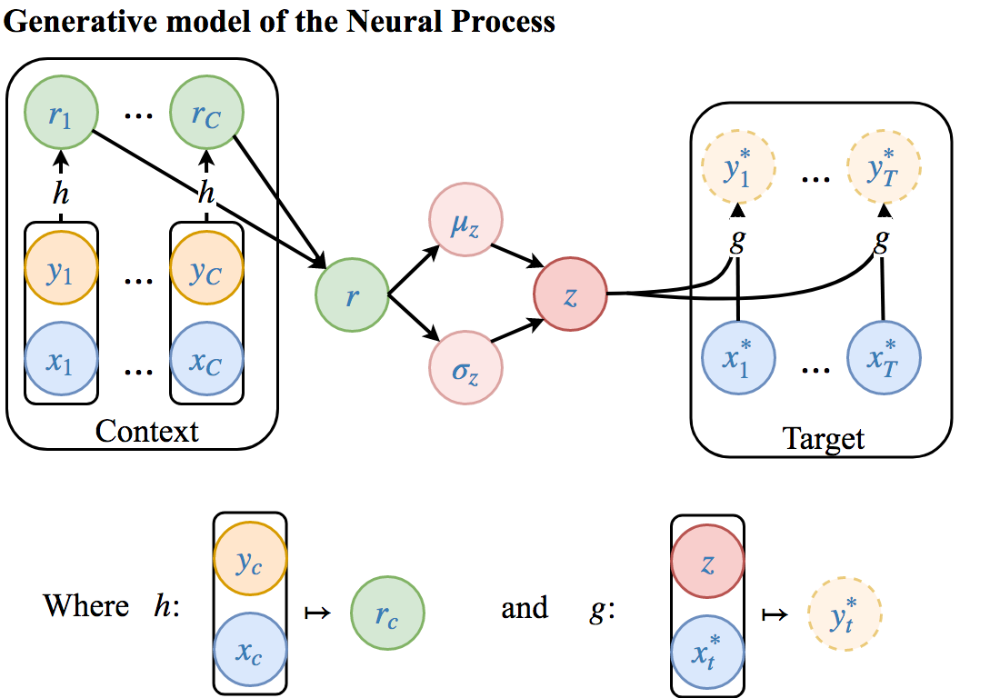
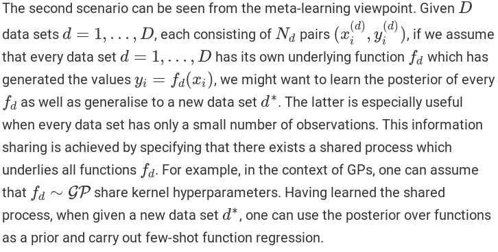
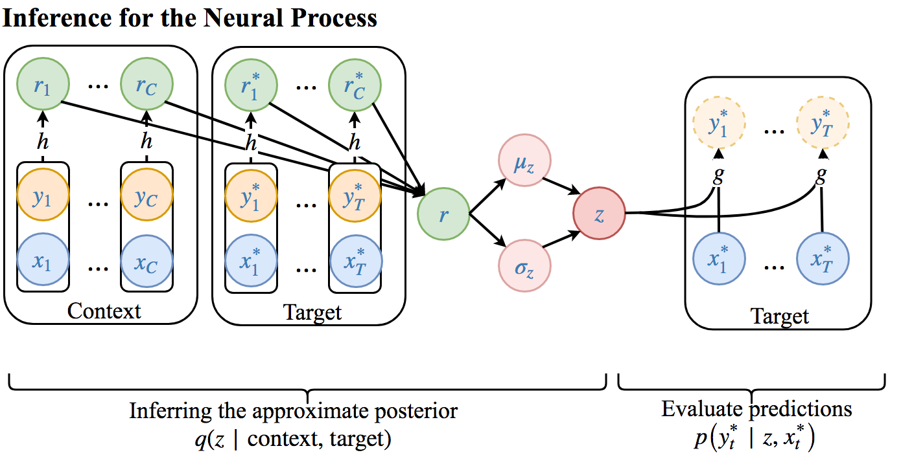
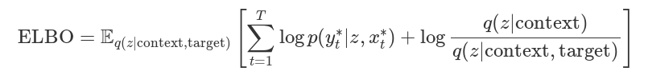

# Neural Processes

Status: Processed
Subtask: i) ts-learning,iv) global-local

[https://kasparmartens.rbind.io/post/np/](https://kasparmartens.rbind.io/post/np/)

[https://chrisorm.github.io/NGP.html](https://chrisorm.github.io/NGP.html)

- These can be used for the "global-local" learning task:

    

    - "The latent z can be seen as a way to share information across different data sets"
    - It can be trained using a very diverse context set, and then a more tailored context set can be given at test time
        - example in waipoua: train with all the transformers, and at prediction use each transformer's measurements only

- Drawbacks:
    - prior is uninterpretable
        - it is set by defining the architectures of h and g
    - very initialization dependent