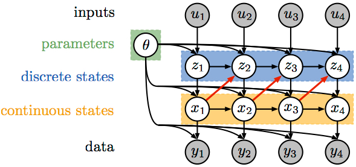

# Recurrent switching linear dynamical systems

Status: To Process
Subtask: i) ts-learning
destination: why-ssm

- [https://paperswithcode.com/paper/recurrent-switching-linear-dynamical-sys2](https://paperswithcode.com/paper/recurrent-switching-linear-dynamical-sys2)

- The red arrow is the main difference towards "vanilla" SLDS
- It allows the discrete state transitions to depend on the continuous latent variable
    - This idea is interesting and I might use it
- Inference is a block Gibbs sampling
    - Didn't dive on this yet. Might not be worth it.